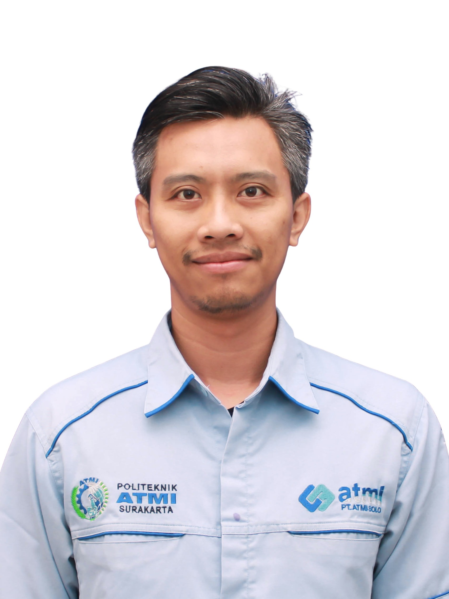
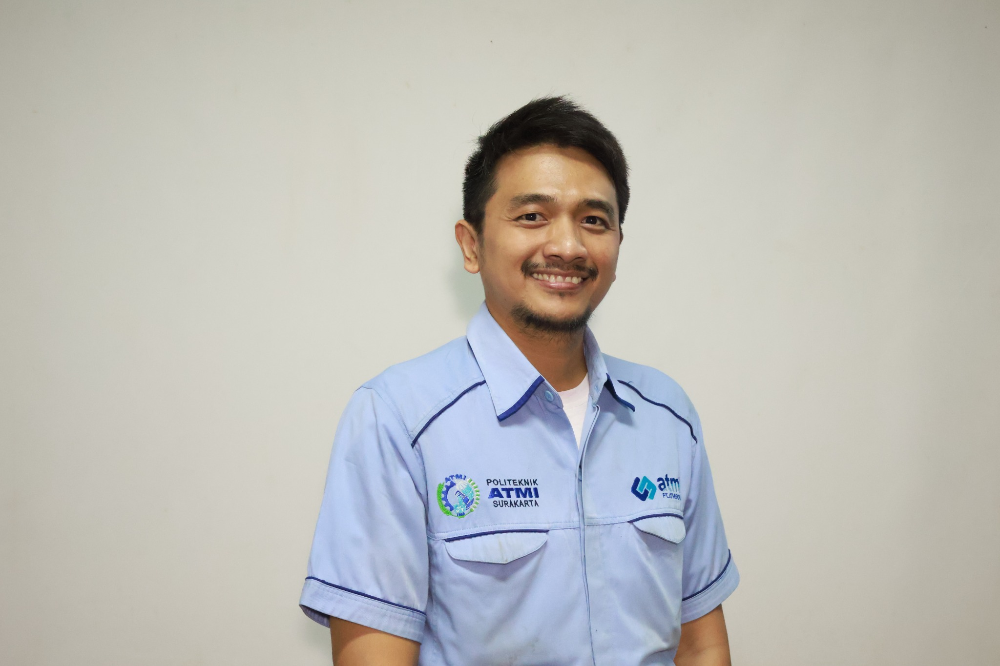
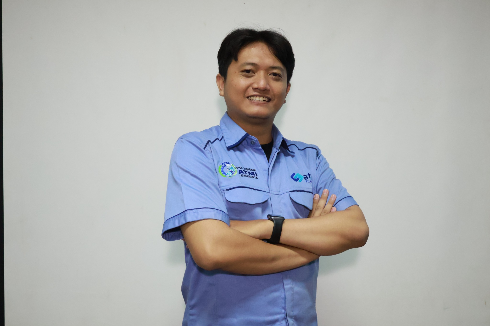

# BENCH WORK 2026–2027

Digital Learning & Practicum Guide — Politeknik ATMI Surakarta.

## Instruktur
1. Chandra Galih Wisudawan
2. Sudibtia Titio Koin
3. Hieronimus Vikko Purohita

## Struktur
```text
.
├── index.html
├── README.md
└── images/
    ├── logo-atmi.jpg
    ├── foto-instruktur-1.jpg
    ├── foto-instruktur-2.jpg
    ├── foto-instruktur-3.jpg
    └── README.txt
```

## Logo ATMI


## Foto Instruktur





